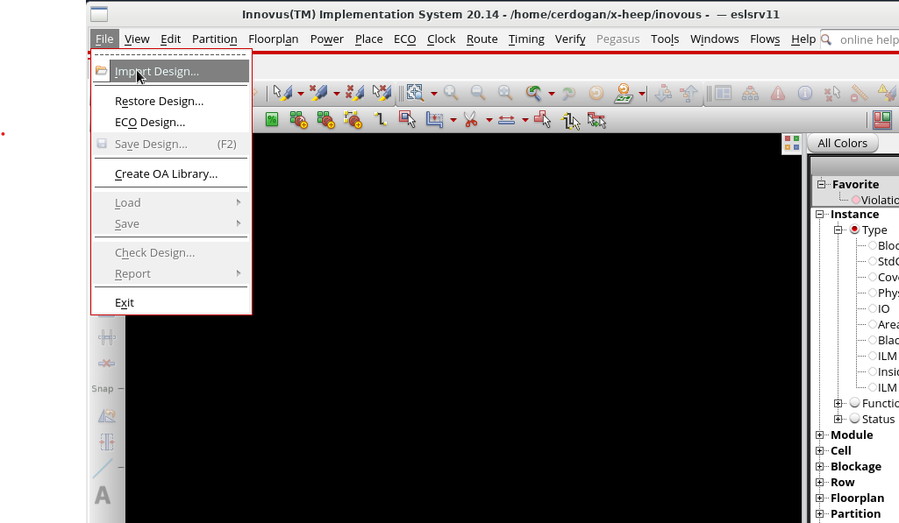
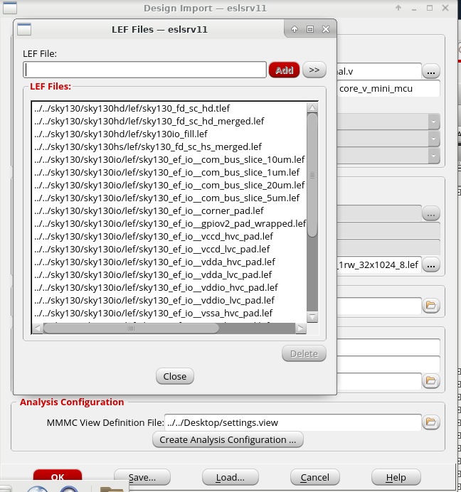
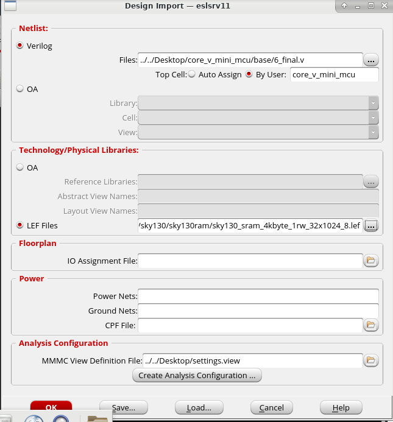

Import the design at innovus start by seleting the verilog file to import the netlist and right the top cell name. 
For the technology files assign the lef files used in the design. It is important the select the tlef file first also depending on the version certain layers might be asked to be defined before other layers therefore check for the possible errors given.
<p align="center"></p>

<p align="center"></p>
```bash
../../sky130/sky130hd/lef/sky130_fd_sc_hd.tlef ../../sky130/sky130hd/lef/sky130_fd_sc_hd_merged.lef ../../sky130/sky130hd/lef/sky130io_fill.lef ../../sky130/sky130hs/lef/sky130_fd_sc_hs_merged.lef ../../sky130/sky130io/lef/sky130_ef_io__com_bus_slice_10um.lef ../../sky130/sky130io/lef/sky130_ef_io__com_bus_slice_1um.lef ../../sky130/sky130io/lef/sky130_ef_io__com_bus_slice_20um.lef ../../sky130/sky130io/lef/sky130_ef_io__com_bus_slice_5um.lef ../../sky130/sky130io/lef/sky130_ef_io__corner_pad.lef ../../sky130/sky130io/lef/sky130_ef_io__gpiov2_pad_wrapped.lef ../../sky130/sky130io/lef/sky130_ef_io__vccd_hvc_pad.lef ../../sky130/sky130io/lef/sky130_ef_io__vccd_lvc_pad.lef ../../sky130/sky130io/lef/sky130_ef_io__vdda_hvc_pad.lef ../../sky130/sky130io/lef/sky130_ef_io__vdda_lvc_pad.lef ../../sky130/sky130io/lef/sky130_ef_io__vddio_hvc_pad.lef ../../sky130/sky130io/lef/sky130_ef_io__vddio_lvc_pad.lef ../../sky130/sky130io/lef/sky130_ef_io__vssa_hvc_pad.lef ../../sky130/sky130io/lef/sky130_ef_io__vssa_lvc_pad.lef ../../sky130/sky130io/lef/sky130_ef_io__vssd_hvc_pad.lef ../../sky130/sky130io/lef/sky130_ef_io__vssd_lvc_pad.lef ../../sky130/sky130io/lef/sky130_ef_io__vssio_hvc_pad.lef ../../sky130/sky130io/lef/sky130_ef_io__vssio_lvc_pad.lef ../../sky130/sky130ram/sky130_sram_1rw1r_128x256_8/sky130_sram_1rw1r_128x256_8.lef ../../sky130/sky130ram/sky130_sram_1rw1r_44x64_8/sky130_sram_1rw1r_44x64_8.lef ../../sky130/sky130ram/sky130_sram_1rw1r_64x256_8/sky130_sram_1rw1r_64x256_8.lef ../../sky130/sky130ram/sky130_sram_1rw1r_80x64_8/sky130_sram_1rw1r_80x64_8.lef
```

MMMC File should look like below

```bash
# Version:1.0 MMMC View Definition File
# Do Not Remove Above Line
create_rc_corner -name rc_corner_typ -qx_tech_file /home/cerdogan/Desktop/qrcTechFile
#-cap_table {TEC/typ/typ.capTbl}
create_rc_corner -name rc_corner_worst -qx_tech_file /home/cerdogan/Desktop/qrcTechFile
#-cap_table {TEC/RCmax/RCmax.capTbl}
create_rc_corner -name rc_corner_best -qx_tech_file /home/cerdogan/Desktop/qrcTechFile
#-cap_table {TEC/RCmin/RCmin.capTbl}

create_library_set -name libs_typ -timing [list \
    /home/cerdogan/sky130/sky130hd/lib/sky130_dummy_io.lib \
    /home/cerdogan/sky130/sky130hd/lib/sky130_fd_sc_hd__tt_025C_1v80.lib \
    /home/cerdogan/sky130/sky130hd_fakestack/lib/fakeram130_64x64.lib \
    /home/cerdogan/sky130/sky130hd_fakestack/lib/fakeram130_256x16.lib \
    /home/cerdogan/sky130/sky130hd_fakestack/lib/fakeram130_256x32.lib \
    /home/cerdogan/sky130/sky130hd_fakestack/lib/fakeram130_256x64.lib \
    /home/cerdogan/sky130/sky130hd_fakestack/lib/fakeram130_256x512.lib \
    /home/cerdogan/sky130/sky130hd_fakestack/lib/sky130_dummy_io.lib \
    /home/cerdogan/sky130/sky130hd_fakestack/lib/sky130_fd_sc_hd__tt_025C_1v80.lib \
    /home/cerdogan/sky130/sky130hs/lib/sky130_fd_sc_hs__tt_025C_1v80.lib \
    /home/cerdogan/sky130/sky130hs/lib/sky130_fd_sc_hs__tt_100C_1v80.lib \
    /home/cerdogan/sky130/sky130io/lib/sky130_dummy_io.lib \
    /home/cerdogan/sky130/sky130ram/sky130_sram_1rw1r_44x64_8/sky130_sram_1rw1r_44x64_8_TT_1p8V_25C.lib \
    /home/cerdogan/sky130/sky130ram/sky130_sram_1rw1r_64x256_8/sky130_sram_1rw1r_64x256_8_TT_1p8V_25C.lib \
    /home/cerdogan/sky130/sky130ram/sky130_sram_1rw1r_80x64_8/sky130_sram_1rw1r_80x64_8_TT_1p8V_25C.lib \
    /home/cerdogan/sky130/sky130ram/sky130_sram_1rw1r_128x256_8/sky130_sram_1rw1r_128x256_8_TT_1p8V_25C.lib ]
create_library_set -name libs_best -timing [list \
    /home/cerdogan/sky130/sky130hd/lib/sky130_dummy_io.lib \
    /home/cerdogan/sky130/sky130hd/lib/sky130_fd_sc_hd__tt_025C_1v80.lib \
    /home/cerdogan/sky130/sky130hd_fakestack/lib/fakeram130_64x64.lib \
    /home/cerdogan/sky130/sky130hd_fakestack/lib/fakeram130_256x16.lib \
    /home/cerdogan/sky130/sky130hd_fakestack/lib/fakeram130_256x32.lib \
    /home/cerdogan/sky130/sky130hd_fakestack/lib/fakeram130_256x64.lib \
    /home/cerdogan/sky130/sky130hd_fakestack/lib/fakeram130_256x512.lib \
    /home/cerdogan/sky130/sky130hd_fakestack/lib/sky130_dummy_io.lib \
    /home/cerdogan/sky130/sky130hd_fakestack/lib/sky130_fd_sc_hd__tt_025C_1v80.lib \
    /home/cerdogan/sky130/sky130hs/lib/sky130_fd_sc_hs__tt_025C_1v80.lib \
    /home/cerdogan/sky130/sky130hs/lib/sky130_fd_sc_hs__tt_100C_1v80.lib \
    /home/cerdogan/sky130/sky130io/lib/sky130_dummy_io.lib \
    /home/cerdogan/sky130/sky130ram/sky130_sram_1rw1r_44x64_8/sky130_sram_1rw1r_44x64_8_TT_1p8V_25C.lib \
    /home/cerdogan/sky130/sky130ram/sky130_sram_1rw1r_64x256_8/sky130_sram_1rw1r_64x256_8_TT_1p8V_25C.lib \
    /home/cerdogan/sky130/sky130ram/sky130_sram_1rw1r_80x64_8/sky130_sram_1rw1r_80x64_8_TT_1p8V_25C.lib \
    /home/cerdogan/sky130/sky130ram/sky130_sram_1rw1r_128x256_8/sky130_sram_1rw1r_128x256_8_TT_1p8V_25C.lib ]
create_library_set -name libs_worst -timing [list \
    /home/cerdogan/sky130/sky130hd/lib/sky130_dummy_io.lib \
    /home/cerdogan/sky130/sky130hd/lib/sky130_fd_sc_hd__tt_025C_1v80.lib \
    /home/cerdogan/sky130/sky130hd_fakestack/lib/fakeram130_64x64.lib \
    /home/cerdogan/sky130/sky130hd_fakestack/lib/fakeram130_256x16.lib \
    /home/cerdogan/sky130/sky130hd_fakestack/lib/fakeram130_256x32.lib \
    /home/cerdogan/sky130/sky130hd_fakestack/lib/fakeram130_256x64.lib \
    /home/cerdogan/sky130/sky130hd_fakestack/lib/fakeram130_256x512.lib \
    /home/cerdogan/sky130/sky130hd_fakestack/lib/sky130_dummy_io.lib \
    /home/cerdogan/sky130/sky130hd_fakestack/lib/sky130_fd_sc_hd__tt_025C_1v80.lib \
    /home/cerdogan/sky130/sky130hs/lib/sky130_fd_sc_hs__tt_025C_1v80.lib \
    /home/cerdogan/sky130/sky130hs/lib/sky130_fd_sc_hs__tt_100C_1v80.lib \
    /home/cerdogan/sky130/sky130io/lib/sky130_dummy_io.lib \
    /home/cerdogan/sky130/sky130ram/sky130_sram_1rw1r_44x64_8/sky130_sram_1rw1r_44x64_8_TT_1p8V_25C.lib \
    /home/cerdogan/sky130/sky130ram/sky130_sram_1rw1r_64x256_8/sky130_sram_1rw1r_64x256_8_TT_1p8V_25C.lib \
    /home/cerdogan/sky130/sky130ram/sky130_sram_1rw1r_80x64_8/sky130_sram_1rw1r_80x64_8_TT_1p8V_25C.lib \
    /home/cerdogan/sky130/sky130ram/sky130_sram_1rw1r_128x256_8/sky130_sram_1rw1r_128x256_8_TT_1p8V_25C.lib ]

#Assign the results files from openroad as constraints
create_constraint_mode -name constraint_best -sdc_files  [list /home/cerdogan/Desktop/base/6_final.sdc ]; 
create_constraint_mode -name constraint_worst -sdc_files [list /home/cerdogan/Desktop/base/6_final.sdc ];
create_constraint_mode -name constraint_typ -sdc_files   [list /home/cerdogan/Desktop/base/6_final.sdc ];

create_constraint_mode -name signoff_constraint_best -sdc_files [list /home/cerdogan/Desktop/base/6_final.sdc ];
create_constraint_mode -name signoff_constraint_worst -sdc_files [list /home/cerdogan/Desktop/base/6_final.sdc ];
create_constraint_mode -name signoff_constraint_typ -sdc_files [list /home/cerdogan/Desktop/base/6_final.sdc ];


create_delay_corner -name delay_corner_typ -library_set libs_typ -rc_corner {rc_corner_typ}
create_delay_corner -name delay_corner_best -library_set libs_best -rc_corner {rc_corner_best}
create_delay_corner -name delay_corner_worst -library_set libs_worst -rc_corner {rc_corner_worst}


create_analysis_view -name analysis_setup_typ -constraint_mode {constraint_typ} -delay_corner {delay_corner_typ}
create_analysis_view -name analysis_setup_bc  -constraint_mode {constraint_best} -delay_corner {delay_corner_best}
create_analysis_view -name analysis_setup_wc  -constraint_mode {constraint_worst} -delay_corner {delay_corner_worst}
create_analysis_view -name analysis_hold -constraint_mode {constraint_typ} -delay_corner {delay_corner_best}

create_analysis_view -name signoff_setup_typ -constraint_mode {signoff_constraint_typ} -delay_corner {delay_corner_typ}
create_analysis_view -name signoff_setup_bc -constraint_mode {signoff_constraint_best} -delay_corner {delay_corner_best}
create_analysis_view -name signoff_setup_wc -constraint_mode {signoff_constraint_worst} -delay_corner {delay_corner_worst}

set_analysis_view -setup {analysis_setup_typ analysis_setup_bc analysis_setup_wc} -hold {analysis_hold analysis_setup_typ analysis_setup_bc analysis_setup_wc}
```

<p align="center"></p>

Reading a def file
```bash
defIn /home/cerdogan/Desktop/base/6_final.def
```
