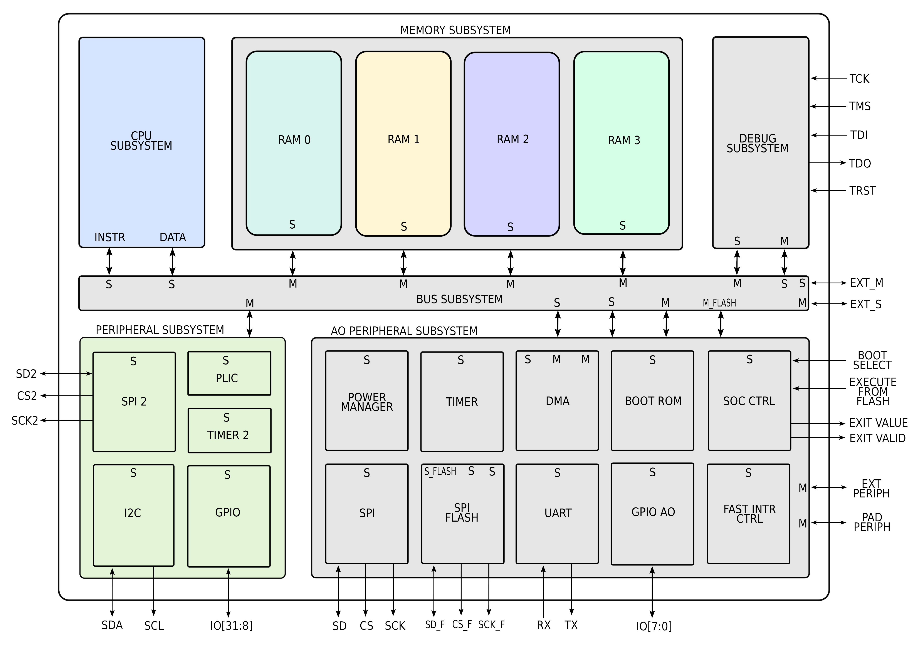

<br />
<p align="center"></p>

`X-HEEP` (eXtendable Heterogeneous Energy-Efficient Platform) is a `RISC-V` microcontroller described in `SystemVerilog`
that can be configured to target small and tiny platforms as well as extended to support accelerators.
The cool thing about `X-HEEP` is that we provide a simple customizable MCU, so CPUs, common peripherals, memories, etc.
so that you can extend it with your own accelerator without modifying the MCU, but just instantiating it in your design.
By doing so, you inherit an IP capable of booting RTOS (such as `freeRTOS`) with the whole FW stack, including `HAL` drivers and `SDK`,
and you can focus on building your special HW supported by the microcontroller.

`X-HEEP` supports simulation with Verilator, Questasim, etc. Morever, FW can be built and linked by using `CMake` either with gcc or with clang. It can be implemented on FPGA, and it supports implementation in Silicon, which is its main (but not only) target. See below for more details.

The block diagram below shows the `X-HEEP` MCU

<p align="center"></p>


> :bookmark_tabs: Please refer to the documentation in [Read the Docs](https://x-heep.readthedocs.io/en/latest/index.html)

# Repository folder structure

    .
    ├── .github/workflows
    ├── ci/scripts
    ├── hw
    │   ├── asic
    │   ├── core-v-mini-mcu
    │   ├── fpga
    │   ├── ip
    │   ├── ip_examples
    │   ├── simulation
    │   └── vendor
    ├── scripts
    │   ├── sim
    │   └── synthesis
    ├── sw
    │   ├── applications
    │   ├── device/lib
    │   ├── linker
    │   └── vendor
    ├── tb
    ├── util
    └── README.md

# Reference

If you use X-HEEP in your academic work you can cite us: [X-HEEP Paper](https://arxiv.org/abs/2401.05548)

```
@misc{machetti2024xheep,
      title={X-HEEP: An Open-Source, Configurable and Extendible RISC-V Microcontroller for the Exploration of Ultra-Low-Power Edge Accelerators},
      author={Simone Machetti and Pasquale Davide Schiavone and Thomas Christoph Müller and Miguel Peón-Quirós and David Atienza},
      year={2024},
      eprint={2401.05548},
      archivePrefix={arXiv},
      primaryClass={cs.AR}
}
```