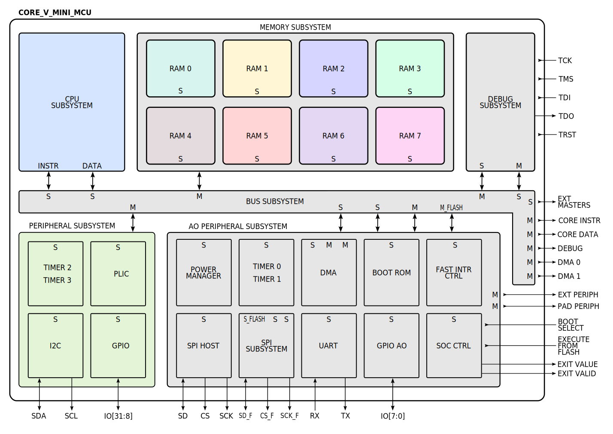

# Repository folder structure

    .
    ├── .github/workflows
    ├── ci/scripts
    ├── hw
    │   ├── asic
    │   ├── core-v-mini-mcu
    │   ├── fpga
    │   ├── ip
    │   ├── ip_examples
    │   ├── simulation
    │   └── vendor
    ├── scripts
    │   ├── sim
    │   └── synthesis
    ├── sw
    │   ├── applications
    │   ├── device/lib
    │   ├── linker
    │   └── vendor
    ├── tb
    ├── util
    └── README.md

======================================
# x-heep
======================================

`X-HEEP` (eXtendable Heterogeneous Energy-Efficient Platform) is a `RISC-V` microcontroller described in `SystemVerilog` 
that can be configured to target small and tiny platforms as well as extended to support accelerators.
The cool thing about `X-HEEP` is that we provide a simple customizable MCU, so CPUs, common peripherals, memories, etc. 
so that you can extend it with your own accelerator without modifying the MCU, but just instantiating it in your design. 
By doing so, you inherit an IP capable of booting RTOS (such as `freeRTOS`) with the whole FW stack, including `HAL` drivers and `SDK`, 
and you can focus on building your special HW supported by the microcontroller.

`X-HEEP` supports simulation with Verilator, Questasim, etc. Morever, FW can be built and linked by using `CMake` either with gcc or with clang. It can be implemented on FPGA, and it supports implementation in Silicon, which is its main (but not only) target. See below for more details.

The block diagram below shows the `X-HEEP` MCU

<p align="center"></p>

# Self-documented Makefile

Note that under `util` folder, the file `generate-makefile-help` is employed to generate a self-documented helping output. In case of including any other target or command under the main `Makefile`, follow the same general and parameter descriptions as already provided for every target. Check the `help` output by doing `make` or `make help`. Moreover, **note that some of the parameters required for some of the targets are initiated with _default values_**

# Prerequisite

## 1. OS requirements

To use `X-HEEP`, first make sure you have the following apt packages, or install them as:

```bash
sudo apt install lcov libelf1 libelf-dev libftdi1-2 libftdi1-dev libncurses5 libssl-dev libudev-dev libusb-1.0-0 lsb-release texinfo autoconf cmake flex bison libexpat-dev gawk tree xterm python3-venv python3-dev
```

In general, have a look at the [Install required software](https://opentitan.org/guides/getting_started/index.html) section of the OpenTitan documentation.

It has been tested only on `Ubuntu 20`, and we know it does NOT WORK on `Ubuntu 22`.

## 2. Python


We rely on either (a) `miniconda`, or (b) `virtual environment` enviroment.

Choose between `2.a` or `2.b` to setup your enviroment.

### 2.a Miniconda

Install [Miniconda](https://docs.conda.io/en/latest/miniconda.html#linux-installers) python 3.8 version as described in the link,
and create the Conda enviroment:

```bash
make conda
```

You need to do it only the first time, then just activate the environment everytime you work with `X-HEEP` as

```bash
conda activate core-v-mini-mcu
```


### 2.b Virtual Environment

Install the python virtual environment just as:

```bash
make venv
```

You need to do it only the first time, then just activate the environment everytime you work with `X-HEEP` as

```bash
source .venv/bin/activate
```

## 3. Install the RISC-V Compiler:

```
git clone --branch 2022.01.17 --recursive https://github.com/riscv/riscv-gnu-toolchain
cd riscv-gnu-toolchain
./configure --prefix=/home/$USER/tools/riscv --with-abi=ilp32 --with-arch=rv32imc --with-cmodel=medlow
make
```

Then, set the `RISCV` env variable as:

```
export RISCV=/home/$USER/tools/riscv
```

Optionally you can also compile with clang/LLVM instead of gcc. For that you must install the clang compiler into the same `RISCV` path. The binaries of gcc and clang do not collide so you can have both residing in the same `RISCV` directory. For this you can set the `-DCMAKE_INSTALL_PREFIX` cmake variable to `$RISCV` when building LLVM. This can be accomplished by doing the following:

```
git clone https://github.com/llvm/llvm-project.git
cd llvm-project
git checkout llvmorg-14.0.0
mkdir build && cd build
cmake -G "Unix Makefiles" -DLLVM_ENABLE_PROJECTS=clang -DCMAKE_BUILD_TYPE=Release -DCMAKE_INSTALL_PREFIX=$RISCV -DLLVM_TARGETS_TO_BUILD="RISCV" ../llvm
cmake --build . --target install
```

## 4. Install Verilator:

```
export VERILATOR_VERSION=4.210

git clone https://github.com/verilator/verilator.git
cd verilator
git checkout v$VERILATOR_VERSION

autoconf
./configure --prefix=/home/$USER/tools/verilator/$VERILATOR_VERSION
make
make install
```
Then, set the `PATH` env variable to as:

```
export PATH=/home/$USER/tools/verilator/$VERILATOR_VERSION/bin:$PATH
```

In general, have a look at the [Install Verilator](https://opentitan.org/guides/getting_started/setup_verilator.html) section of the OpenTitan documentation.

If you want to see the vcd waveforms generated by the Verilator simulation, install GTKWAVE:

```
sudo apt install libcanberra-gtk-module libcanberra-gtk3-module
sudo apt-get install -y gtkwave
```

## Files are formatted with Verible

We use version v0.0-1824-ga3b5bedf

See: [Install Verible](https://opentitan.org/guides/getting_started/index.html#step-6a-install-verible-optional)

To format your RTL code type:

```
make verible
```
## Compilation Flow and Package Manager

We use [FuseSoC](https://github.com/olofk/fusesoc) for all the tools we use.

The `fusesoc` commands are inside the Makefile.

# Adding external IPs

This repository relies on [vendor](https://opentitan.org/book/util/doc/vendor.html) to add new IPs.
In the ./util folder, the vendor.py scripts implements what is describeb above.

# Compiling with Makefile

You can compile the example applications and the platform using the Makefile. Type 'make help' or 'make' for more information. Moreover, please, check the different 'clean' commands to verify that you are using the corret one.

## Generate core-v-mini-mcu package

First, you have to generate the SystemVerilog package and C header file of the core-v-mini-mcu:

```
make mcu-gen
```

To change the default cpu type (i.e., cv32e20), the default bus type (i.e., onetoM) type
or the memory size (i.e., number of banks):

```
make mcu-gen CPU=cv32e40p BUS=NtoM MEMORY_BANKS=16
```

The last command generates x-heep with the cv32e40p core, with a parallel bus, and 16 memory banks,
each 32KB, for a total memory of 512KB. Note that in case of executing a FreeRTOS-based application, 
the **minimum memory banks should be set to 5**. This is related to the FreeRTOS code and ram requirements.

## Compiling Software

Don't forget to set the `RISCV` env variable to the compiler folder (without the `/bin` included).
To run 'hello world' application, just type 'make app'. 

```
make app
```

To run any other application, please use the following command with appropiate parameters:

```
app PROJECT=<folder_name_of_the_project_to_be_built> MAINFILE=<main_file_name_of_the_project_to_be_built  WITHOUT EXTENSION!> TARGET=sim(default),pynq-z2 LINKER=on_chip(default),flash_load,flash_exec COMPILER=gcc(default),clang ARCH=rv32imc(default),<any RISC-V ISA string supported by the CPU>

Params:
- PROJECT (ex: <folder_name_of_the_project_to_be_built>, hello_wolrd(default))
- MAINFILE (ex: <main_file_name_of_the_project_to_be_built WITHOUT EXTENSION!>, hello_wolrd(default))
- TARGET (ex: sim(default),pynq-z2)
- LINKER (ex: on_chip(default),flash_load,flash_exec)
- COMPILER (ex: gcc(default),clang)
- ARCH (ex: rv32imc(default),<any RISC-V ISA string supported by the CPU>)
```

For instance, to run 'hello world' app for the pynq-z2 FPGA targets, just run:

```
make app TARGET=pynq-z2
```

This will create the executable file to be loaded in your target system (ASIC, FPGA, Simulation).
Remember that, `X-HEEP` is using CMake to compile and link. Thus, the generated files after having
compiled and linked are under `sw\build`

## FreeROTS based applications

'X-HEEP' supports 'FreeRTOS' based applications. Please see `sw\applications\blinky_freertos`.
Note that before runing such application, and due to current memory constraints, the core-v-mini-mcu package needs to be generated using more memory banks than the default settings. Thus, as previously specified: in case of executing a FreeRTOS-based application, the **minimum memory banks should be set to 5**. This is related to the FreeRTOS code and ram requirements. In this case, please, run the following command:

```
make mcu-gen MEMORY_BANKS=5
```

After that, you can run the command to compile and link the FreeRTOS based application. Please also set 'LINKER' and 'TARGET' parameters if needed.

```
make app PROJECT=blinky_freertos MAINFILE=main 
```

The main FreeRTOS configuration is allocated under `sw\freertos`, in `FreeRTOSConfig.h`. Please, change this file based on your application requirements.
Moreover, FreeRTOS is being fetch from 'https://github.com/FreeRTOS/FreeRTOS-Kernel.git' by CMake. Specifically, 'V10.5.1' is used. Finally, the fetch repository is located under `sw\build\_deps` after building.

## Simulating

This project supports simulation with Verilator, Synopsys VCS, and Siemens Questasim.

### Compiling for Verilator

To simulate your application with Verilator, first compile the HDL:

```
make verilator-sim
```

then, go to your target system built folder

```
cd ./build/openhwgroup.org_systems_core-v-mini-mcu_0/sim-verilator
```

and type to run your compiled software:

```
./Vtestharness +firmware=../../../sw/build/main.hex
```

or to execute all these three steps type:

```
make run-helloworld
```


### Compiling for VCS

To simulate your application with VCS, first compile the HDL:

```
make vcs-sim
```

then, go to your target system built folder

```
cd ./build/openhwgroup.org_systems_core-v-mini-mcu_0/sim-vcs
```

and type to run your compiled software:

```
./openhwgroup.org_systems_core-v-mini-mcu_0 +firmware=../../../sw/build/main.hex
```

### Compiling for Questasim

To simulate your application with Questasim, first set the env variable `MODEL_TECH` to your Questasim bin folder, then compile the HDL:

```
make questasim-sim
```

then, go to your target system built folder

```
cd ./build/openhwgroup.org_systems_core-v-mini-mcu_0/sim-modelsim/
```

and type to run your compiled software:

```
make run PLUSARGS="c firmware=../../../sw/build/main.hex"
```

You can also use vopt for HDL optimized compilation:

```
make questasim-sim-opt
```

then go to

```
cd ./build/openhwgroup.org_systems_core-v-mini-mcu_0/sim_opt-modelsim/
```
and

```
make run RUN_OPT=1 PLUSARGS="c firmware=../../../sw/build/main.hex"
```

You can also compile with the UPF power domain description as:

```
make questasim-sim-opt-upf FUSESOC_FLAGS="--flag=use_upf"
```

and then execute software as:

```
make run RUN_OPT=1 RUN_UPF=1 PLUSARGS="c firmware=../../../sw/build/main.hex"
```

Questasim version must be >= Questasim 2020.4

### UART DPI

To simulate the UART, we use the LowRISC OpenTitan [UART DPI](https://github.com/lowRISC/opentitan/tree/master/hw/dv/dpi/uartdpi).
Read how to interact with it in the Section "Running Software on a Verilator Simulation with Bazel" [here](https://opentitan.org/guides/getting_started/setup_verilator.html#running-software-on-a-verilator-simulation-with-bazel).
The output of the UART DPI module is printed in the `uart0.log` file in the simulation folder.

For example, to see the "hello world!" output of the Verilator simulation:

```
cd ./build/openhwgroup.org_systems_core-v-mini-mcu_0/sim-verilator
./Vtestharness +firmware=../../../sw/build/main.hex
cat uart0.log
```
## Debug

Follow the [Debug](./Debug.md) guide to debug core-v-mini-mcu.

## Execute From Flash

Follow the [ExecuteFromFlash](./ExecuteFromFlash.md) guide to exxecute code directly from the FLASH with modelsim, FPGA, or ASIC.

## Emulation on Xilinx FPGAs

This project offers two different X-HEEP implementetions on the Xilinx FPGAs, called Standalone-FEMU and Linux-FEMU.

### Standalone-FEMU (Standalone Fpga EMUlation)

In this version, the X-HEEP architecture is implemented on the programmable logic (PL) side of the FPGA, and its input/output are connected to the available headers on the FPGA board.

Make sure you have the FPGA board files installed in your Vivado.

For example, for the Xilinx Pynq-Z2 board, use the documentation provided at the following [link](https://pynq.readthedocs.io/en/v2.5/overlay_design_methodology/board_settings.html) to download and install them:

To build and program the bitstream for your FPGA with vivado, type:

```
make vivado-fpga FPGA_BOARD=pynq-z2
```

or add the flag `use_bscane_xilinx` to use the native Xilinx scanchain:

```
make vivado-fpga FPGA_BOARD=pynq-z2 FUSESOC_FLAGS=--flag=use_bscane_xilinx
```

Only Vivado 2021.2 has been tried.

To program the bitstream, open Vivado,

```
open --> Hardware Manager --> Open Target --> Autoconnect --> Program Device
```

and choose the file `openhwgroup.org_systems_core-v-mini-mcu_0.bit`

To run SW, follow the [Debug](./Debug.md) guide
to load the binaries with the HS2 cable over JTAG,
or follow the [ExecuteFromFlash](./ExecuteFromFlash.md)
guide if you have a FLASH attached to the FPGA.


Do not forget that the `pynq-z2` board requires you to have the ethernet cable attached to the board while running.


### Linux-FEMU (Linux Fpga EMUlation)

In this version, the X-HEEP architecture is implemented on the programmable logic (PL) side of the FPGA and Linux is run on the ARM-based processing system (PS) side of the same chip.

Read the [following](./linux_femu/README.md) documentation to have more information about this implementation.


# ASIC Implementation

This project can be implemented using standard cells based ASIC flow.

## Synthesis with Synopsys Design Compiler

First, you need to provide technology-dependent implementations of some of the cells which require specific instantiation.

Then, please provide a set_libs.tcl and set_constraints.tcl scripts to set link and target libraries, and constraints as the clock.

To generate the `analyze` script for the synthesis scripts with DC, execute:

```
make asic
```

## OpenRoad support for SkyWater 130nm

We are working on supporting OpenRoad and SkyWater 130nm PDK, please refer to the
[OpenRoadFlow](./OpenRoadFlow.md) page. This is not ready yet, it has not been tested.

This relies on a fork of [edalize](https://github.com/davideschiavone/edalize) that contains templates for Design Compiler and OpenRoad.
