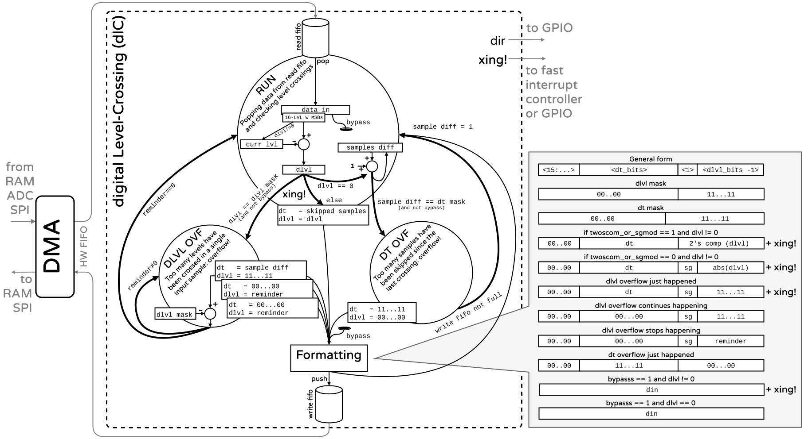

# Digital Level-Crossing (dLC)

The digital Level-Crossing block (dLC) is an external peripheral intended to be connected to the DMA's HW fifo interface. It can take data from the DMA (up to 16-bit words) and compare them against pre-defined levels, replicating in the digital domain the behavior of a [Level-Crossing ADC](https://ieeexplore.ieee.org/abstract/document/9911506). The block constantly tracks the last crossed level. While the input data remains at a small distance from that level, the dlC simply discards it. If the input data differs more than a specified amount instead, the dLC outputs outputs the difference in levels, the number of skipped sampled and triggers an interrupt signaling a crossing (xing). 

The dLC block can be used to filter input data, reduce the output data rate from an ADC, as a wake-up system or as part of a feedback loop. An additional output can be exposed to an IO pad with the direction of the crossing to form a dir/req pair to be fed to an off-chip SNN or for data transmission. 

## Operation

The dLC block works as a digital filter, that literally filters out data that is "redundant", and reduces the bit-depth of the data that is not redundant by computing the difference with the last output. How much this difference should be is configurable from SW by setting the `LVL W` (level width) register. 

If the input data differs more than the level width in any direction a new output will be generated, formatted and added to the write fifo. If this is not the case, the sample is discarded and a count controlling the samples' difference is increased.

The data output format can be configured to specify 
1. the number of bits dedicated to the level difference `dlvl`
1. the format of these (2's complement or sign + absolute value)
1. the number of bits dedicated to the samples' difference `dt`

It is possible that the input data crosses more levels than the maximum number that can be stored in the assigned bits. To see how the dLC manages the `dlvl` overflow see [DLVL overflow](#dlvl-overflow). 

It is also possible that no sample crosses the any level for an extended period of time, exceding the maximum possible count in the bits assigned to `dt`. To see how the dLC manages the `dt` overflow see [DT overflow](#dt-overflow).

The dLC logic can still be used while preserving all the input data. For this, see [bypass](#bypass). 


### General case 
At every new sample available to the DMA, the input data (`din`) is loaded in the the `read fifo`. This is popped by the dLC while it is on the `RUN` state. 
The input data is right shifted `LVL W` bits, so the `16 - LVL W` most significant bits of the input data are taken. This number of bits represent the width of the levels and force the level width to be a power of two. 

The piece of the input data corresponding to its level gets subtracted the last crossed level to obtain the level difference `dlvl`. This difference is used to decide how the dLC should proceed. 

1. If `dlvl` is zero, no level was crossed. The samples' difference count is increased by one and the sample is discarded. If the count of samples' difference overflows the number of bits assigned to it, the dLC goes to the `DT OVF` state to add an output word with no difference in levels but full difference in samples. See [DT overflow](#dt-overflow). Then operation proceeds as usual. 
1. If `dlvl` is different from zero, there was a crossing, so several things need to be done:  
    * the sign of the crossing is extracted (most significant bit of `dlvl`)
    * the `xing` signal needs to be raised to generate an interrupt
    * if the `dlvl` value does not overflow, a sample is output
    * if the `dlvl` value is overflowed, the dLC goes to the `DLVL OVF` state
1. In the `DLVL OVF` state the dLC generates outputs with `dt=0` and subtracts from the `dlvl` value the `dlvl` mask (maximum possible value) until the result is negative (the reminder can be represented in the assigned bits). See [DLVL overflow](#dlvl-overflow). Then operation proceeds as usual.
1. In the `bypass` mode the dLC performs the comparisons in the `RUN` state to obtain the `xing` and `dir` signals, but does not generate outputs or changes states. 
1. Every time the dLC returns to the `RUN` state or after sending outputs, the samples' difference counter is returned to 1 (to signify that the next sample is no longer associated with the same timestamp).  





## Formatting

Before being pushed to the write fifo, samples are formatted according to sw-configurable format. The three variables that need to be specified are: 
1. Number of bits assigned to `dlvl` (including sign)
1. Number of bits assigned to `dt`
1. If the `dlvl` should be expressed in twos complement or as sign + absolute value. 

The three pieces of information are placed as follows: 
```
<dt> <sg> <dlvl>
```
The formatter will always output 16-bit words. If the bit widths do not add up to 16, the MSBs will be filled with 0. It is responsability of the user to configure the DMA to only take 8 bits if the output word fits in 8 bits. 

Both `dlvl` and `dt` cannot be allocated more than 8-bits each. 

### Masks and unmasking

To ease the hw computation of the formatting, the user needs to provide through the mask registers how the data should be formatted (so this is computed once in software, instead of every time in hardware). 

The `dlvl_mask` should be as many 1s in the LSBs as bits were assigned to `dlvl` (excluding sign). For example, if 7 bits will be used for the level difference, the `dlvl_mask` should be filled with 1s to the right until the 6th bit:
```
0000 0000 0011 1111
```
The 7th bit will be used by the sign (both in twos complement or in sign + absolute value mode). 

The `dt_mask` should be as many 1s in the LSBs where `dt` as bits were assigned to `dt`. For example, following the previous case, and if we assign 4 bits for `dt`, the `dt_mask` should look like: 
```
0000 0000 0000 1111
```

So you don't have to think about it, here is how to compute the masks, and how to unmask the received value to extract `dlvl` and `dt`. 

```c
// Assign bits
dlvl_bits   = 7;
dt_bits     = 4;
twoscomp    = true; //or false, as you wish...

// Compute the masks
dlvl_mask   = ( 1 << ( dlvl_bits - 1 )) -1;
dt_mask     = (( 1 << dt_bits ) -1 );

// Compute the "unmasks" (masks used to retrieve the values)
dlvl_umask      = dlvl_mask;
dir_umask       = 1 << dlvl_bits;
dlvl_2s_umask   = ( 1 << ( dlvl_bits - 1 )) -1; //keep the sign
dt_umask        = dt_mask  << dlvl_bits;

// Unmask the received value
if( twoscomp ){
    dlvl    = val & dlvl_2s_umask;
} else {
    dlvl    = val & dlvl_mask;
}
dir         = ( val & sign_umask ) >> (dlvl_bits-1);
dt          = ( val & dt_umask ) >> (dlvl_bits);  
```

### DLVL overflow

When the number of bits assigned to `dlvl` are not sufficient, a first word is output with all 1s on the `dlvl` side (naturally) and the samples differene `dt`. The next samples will have `dt` all 0s (to signify that the difference in level still corresponds to the same instant in time) and the `dlvl` that remains from subtracting the maximum possible value. The sign criteria remains unchanged. 
A `xing` event is only generated with the first output word. Words generated by overflow do not generate more `xing` events. 

### DT overflow

When the number of bits assigned to `dt` are not sufficient, a word is output with all 1s on the `dt` side (naturally) and all 0s on the `dlvl` side (including the sign), as no levels will have been crossed. 
Words genersted by `dt` overflow do not generate a `xing` event.


### Reconstruction

In the case of overflows the formatting criteria remains unchanged. From the reconstruction side there is no need to account for exceptional cases due to overflows. The logic should remain

```c
t[i]    = t[i-1] + dt
lvl[i]  = lvl[i-1] + dlvl
```
to obtain a pair `(t, lvl)` that represents each sample that was received.

Alternativelly: 

```c
t[i]    = t[i-1] + dt
lvl[i]  = lvl[i-1] + dlvl
i       += (dt != 0)
```

## Special use cases

### Bypass

It is possible to bypass the output generation of the dLC. This is useful to keep the original data (with all its resolution), but generate `xing` events to wake-up the CPU or output to an off-chip system. 

When `bypass` is enabled the dLC will still compute the `dlvl` difference and trigger `xing` if its different from 0, but will not enter any of the `OVF` states or push data formatted data into the write fifo. The input popped from the read-fifo is directly sent to the write fifo.

### Differentiation

The dLC can be used as a differentiation block by assigning 0 bits to `dt`, as many as desired to `dlvl` (below the permissible 8-bits) and setting the level width to a single bit (`LVL W = 1`). This will generate an output on every single input data, and the result will be the difference with the previous value. 

