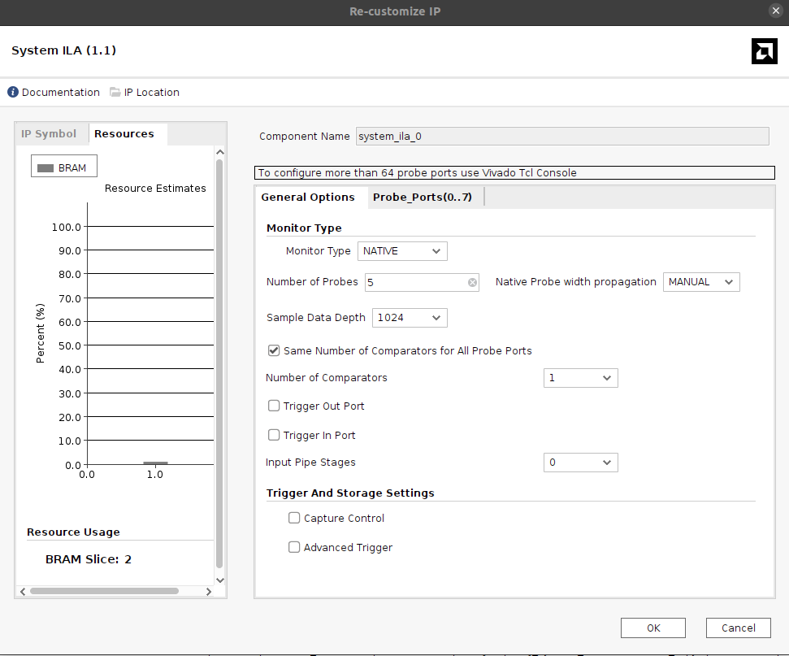
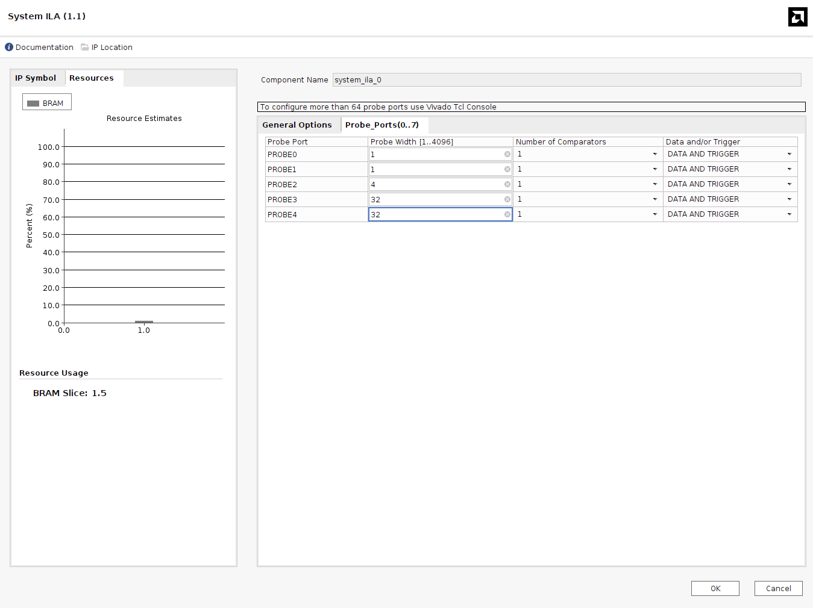
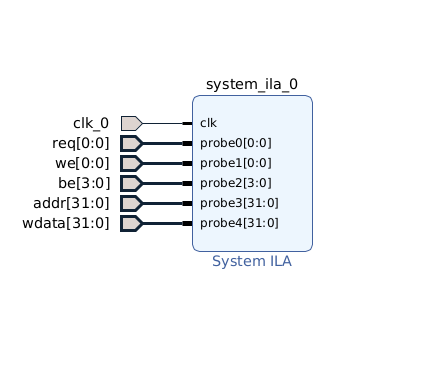
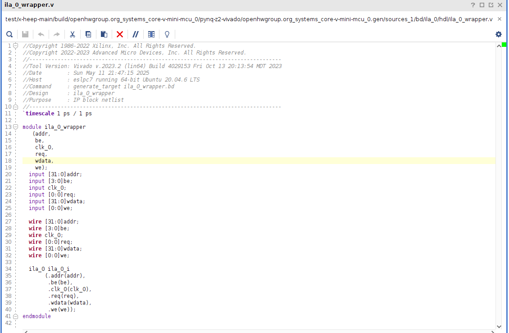
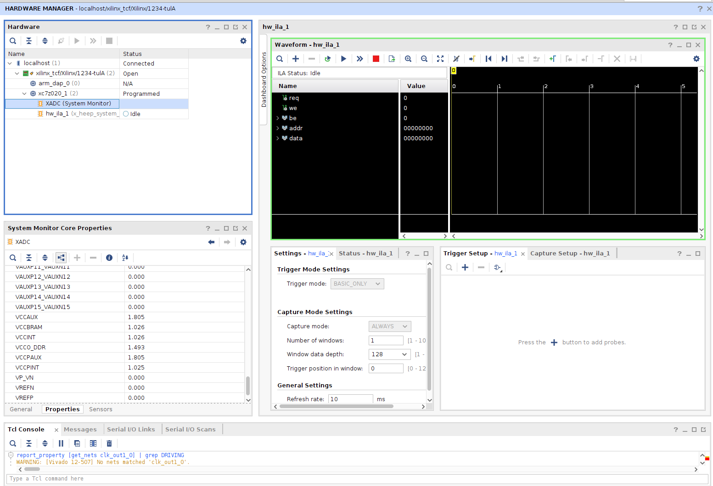
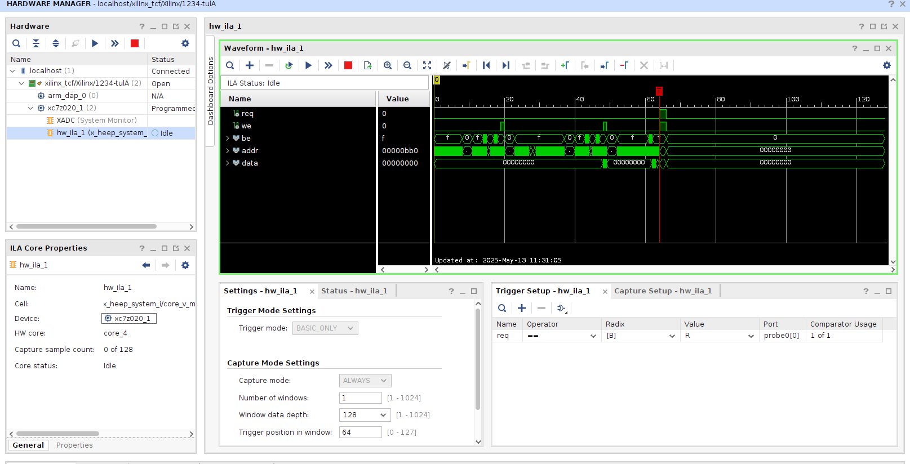

# Using ILA for Debugging in Vivado

## 🧠 What is the Integrated Logic Analyzer (ILA)?

The **Integrated Logic Analyzer (ILA)** is a built-in debug core in Vivado that allows real-time observation of internal FPGA signals. It works like a digital oscilloscope inside the FPGA, capturing signal transitions based on customizable trigger conditions. This enables you to debug and analyze logic behavior without needing external test equipment or adding temporary output pins.

Vivado has included the Integrated Logic Analyzer (ILA) IP core as a bundled feature since at least the 2013.1 release, and it is available in all Vivado design tool versions, including the most recent 2025.1 version.

## 🛠️ Debugging X-HEEP on FPGA with ILA

To debug the **X-HEEP** SoC running on an FPGA like the ZCU104 using the ILA tool:

1. **Insert the ILA Core**

   - Open your Vivado project (you need your precompiled bitstream—please refer to the [Bitstream Generation Guide](./RunOnFPGA.md)).
   - Click on **Create Block Design** and name it so that you can easily find it later.
   - Press **+** and search for **System ILA**.
   - Double-click to configure the IP. In **General Options**, choose **Monitor Type** as **Native** to customize your signal probes (interface used for AXI signals). For native probe width propagation, you can leave it as **AUTO**. If you choose **Manual**, you will need to manually specify the bit width of each signal. The **Number of Probes** corresponds to the number of signals you want to monitor. 
   
   
   
   For example, to observe the OBI `obi_req_t` structure:

   ```systemverilog
   typedef struct packed {
     logic        req;
     logic        we;
     logic [3:0]  be;
     logic [31:0] addr;
     logic [31:0] wdata;
   } obi_req_t;
   ```

2. **Configure Probes**
   - Inside the Probe_Ports if you have chosen "Manual" probe width propagation you need to manually specify the signals length. In most of the cases you can keep number of comparators to 1, you need  to modify this parameter only if you want to catch this signal being equal to different signals (FSM case). Please refer to the ILA documentation.
   
   - To keep the IP clean and tidy right click and **make external**. This will allow you to rename the probes and to extract the VHDL script which you will be able to connect within your RTL.
   
   - Save it and close it.

3. **Generate RTL wrapper**
   - Inside **Hierarchy** find the ila you just generated (if it is not visible try to click update IP sources).
   - Right click **Create HDL Wrapper**  (In our case we need to connect the ILA within the RTL since X-HEEP does not allow you to see the whole Block Diagram due to the diversity of the HDL languages. For this case we create the HDL wrapper which is needed to beconnected inside the RTL modules).
   

4. **Connect ILA to your RTL**
   - Connect it to the signals within your RTL by instantiation the ILA module same way as you do for any other module.

5. **Generate Bitstream**
   - You need to synthesize, implement, and regenerate the bitstream with the ILA logic included.
   ```{note}
   Your ILA block can not be compiled with mcu-gen/verilator. So you have to rerun your synthesis & implementation with Vivado.
   ```

6. **Program the Board and Use the ILA Debugger**
   - Open *Hardware Manager* and program the FPGA with the new bitstream.
   You should see the empty waveform window. Then you need to insert your probe trigger signal setting by clicking **+** in the trigger setup window. In your hardware window the status of ILA should be IDLE.
   - Set up trigget settings:
      - Increase **Window Data Depth** to 128 (how many cycles you are gonna catch)
      - **Trigger Position Window** is telling you when you are gonna see your signal: 0 - you see the transmission and then WDD of clock cycles, 64 - you see 64 cycles before your trigger and 64 after.
   

   - CLick run and your status shold change to **Waiting for Trigger**
   - As soon as you press the SW reset on FPGA you are gonna see your waveforms


```{note}
   If when you press **start** button and your status never goes into waiting for trigger mode you might have messed up few things with the clock so check the next point.   
```
7. **Troubleshoot**
   - Be careful with correctly initializing your ILA within your rtl. The clock which is used with ILA should be the same as your system clock and it should not pass any CDCs, Clock Dividors, Resetted Clock or anything which can perturb the system clock. If you use it within core-v-mini-mcu as in the image it should work well.
   - Not obvious problem could be that the JTAG clock is too fast for your ILA to sense the clock so follow the next steps to solve your problem:
      - DO not delete or change anything in your design if you are sure the clock is safe and sound and your trigger signal is moving (you can run picocom in parallel with ILA and if you see the output on the terminal you are sure that your FPGA is correctly running).
      - Close the hardware manager and reopen it without connection to your board. Then **Open Target** -> **Next** -> Select what to connect to 99%  stay on local server and click **Next** -> NOW in the JTAG Clock Frequency choose lower one (in pynq z2 the default one is 15MHz, so you can decrease it to 10 or 5 MHz) and click Next. Try to run and see if the status of your ILA changes to **Waiting for Trigger** and test it with the sw reset.  
```{Warning}
   Do not decrease it the JTAG Frequency too much, it is not gonna work either. You need to find the golden middle.
```

## ✅ Tipz

Use ILA especially when debugging:
- AXI transactions
- Handshakes in the instruction or data interfaces.
- **Timing issues** or unexpected behavior in custom logic (your simulation works, but FPGA fails).
- [Refer to the AMD Documentation](https://docs.amd.com/r/en-US/ug936-vivado-tutorial-programming-debugging/Using-the-Vivado-Integrated-Logic-Analyzer)
