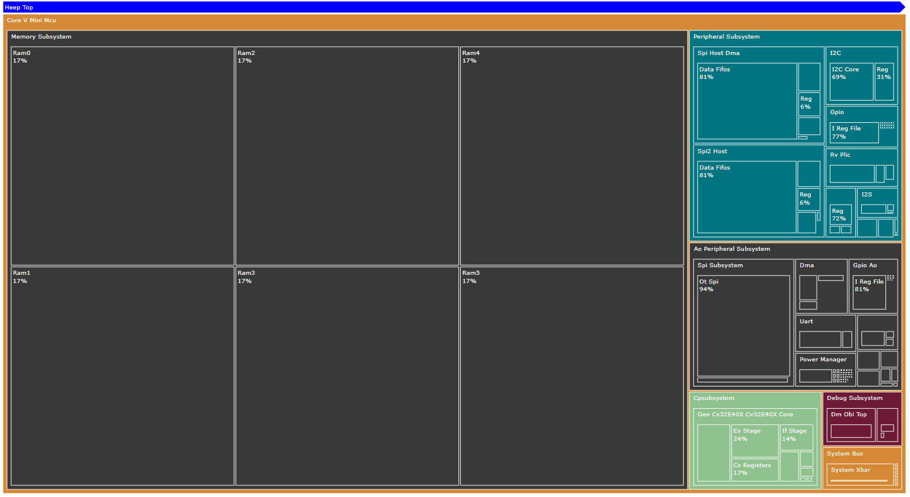

# Area Plot
X-HEEP offers the possibility to visualize post-synthesis area reports using the [area_plot](https://github.com/vlsi-lab/area-plot-post-syn.git) Python package.
The tool, based on [`plotly`](https://plotly.com) `treemap` graphics, provides an interactive interface for hierarchical design exploration, making it easier to analyze the relative area contributions of various submodules and their impact on the overall design.



The tool can generate output in multiple formats: (`.png`, `.svg`, `.html`). The `html` format allows for full interactivity and can be opened in any web browser.


> **Note**: Currently, only Synopsys Design Compiler area report format is fully supported.

## How to Use

After running synthesis and generating an area report, you can obtain your area plot by running:

```sh
make area-plot
```
`kaleido` requires a compatible version of Chrome (or Chromium) installed to save the output image. If you don't have it in your system, don't worry, `plotly` will provide it,
just follow the prompt and paste on your terminal:

```sh
plotly_get_chrome
```

You can also customize the input report path, output directory, and top-level module for the plot (which may differ from X-HEEP’s main top-level) by providing additional arguments. For example:
```sh
make area-plot AREA_PLOT_RPT=./build/area.rpt AREA_PLOT_OUTDIR=./util/area-plot/ AREA_PLOT_TOP=u_core_v_mini_mcu
```

For more advanced options, run:
```sh
area-plot --help
```

## Viewing the Area Plot
To navigate the generated plot interactively, open the `html` file in a web browser. 
For example:
```
firefox util/area-plot/u_core_v_mini_muc_treemap.html
```
While navigating the plot, hovering over a module will display detailed information, such as its absolute area and the percentage it occupies within its parent module.