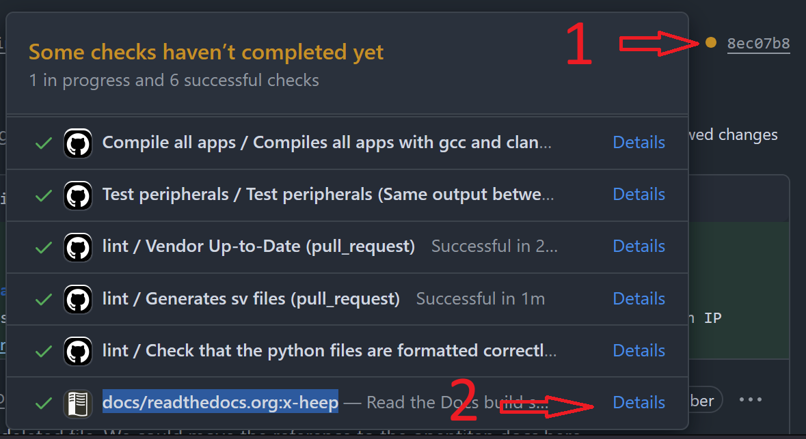

# Update the documentation

All documentation is found in the `/docs` directory. Thank you for helping keep X-HEEP accurately and extensively documented!

1. If you need to create a new entry, add the new document in markdown (`.md` extension) to the corresponding folder. Otherwise, just edit the corresponding file.

```{note}
Make sure the document has one single `# header`, otherwise they will be considered different documents.
```

2. If a new folder is added, add it to the `toctree` inside the corresponding index file.
3. Check the changes to the readthedocs locally (check [Build locally the web documentation](#build-locally-the-web-documentation) below).
3. Commit and push.
4. Open a pull request and you can preview the updates to the docs in the CI build.



This should open a preview of the documentation changes in the webpage. The link should be similar to <https://x-heep--753.org.readthedocs.build/en/753/> but with your pull request number instead of `753`.

5. Once the pull request is merged, the documentation will be updated automatically.

## Build locally the web documentation

If you want to build the web documentation locally to see your updates to the docs or to debug the build:

1. Open a terminal in the `docs` folder and make sure the conda environment is activated.
2. Run:

```bash
make clean html
```

3. Open `docs/build/html/index.html` using a web browser.
