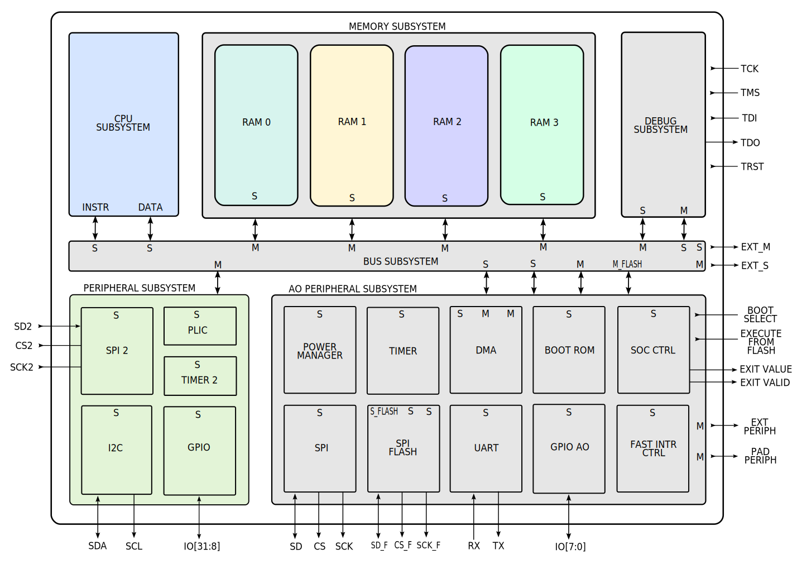
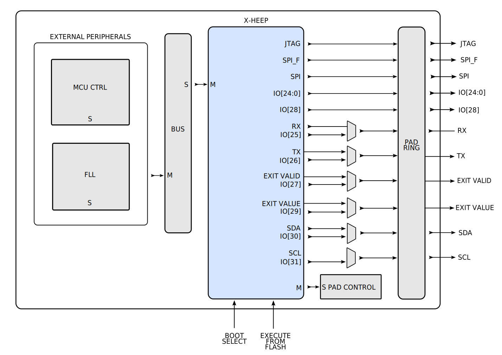

X-HEEP
======

``X-HEEP`` (eXtendable Heterogeneous Energy-Efficient Platform) is a RISC-V microcontroller described in SystemVerilog that can be configured to target small and tiny platforms as well as extended to support accelerators.
The cool thing about X-HEEP is that we provide a simple customizable MCU, so CPUs, common peripherals, memories, etc. so that you can extend it with your own accelerator without modifying the MCU, but just instantiating it in your design.
By doing so, you inherit an IP capable of booting RTOS (such as FreeRTOS) with the whole FW stack, including HAL drivers and SDK, and you can focus on building your special HW or APP supported by the microcontroller.

X-HEEP supports simulation with Verilator, Questasim, etc. Morever, FW can be built and linked by using CMake either with gcc or with clang and/or SEGGER Embedded Studio using gcc. It can be implemented on FPGA, and it supports implementation in Silicon, which is its main (but not only) target.
You are welcome to explore our `X-HEEP repository <https://github.com/esl-epfl/x-heep>`_ or our `X-HEEP paper <https://infoscience.epfl.ch/record/302127>`_ for a deeper description of the platform.

Architecture
^^^^^^^^^^^^
The architecture is thought to be divided into the following power domains: CPU subsystem domain, memory banks domains, peripheral subsystem domain and always-on peripheral subsystem domain. The following image highlights each power domain with a different colour. IPs are carefully selected and grouped in the mentioned power domains in order to maximize energy savings during the processing and acquisition phases of our target ultra-low-power edge-computing applications. We reused several IPs from the most important open-source projects, such as `PULP <https://github.com/pulp-platform>`_, `OpenHW <https://github.com/openhwgroup>`_ and `lowRISC <https://github.com/lowRISC>`_. Moreover, we custom-designed some specific IPs to meet our architectural needs.

CPU subsystem domain
^^^^^^^^^^^^^^^^^^^^

The CPU subsystem is based on the `RISC-V lowRISC Ibex <https://github.com/lowRISC/ibex>`_, a 32-bit open-source low-power core originally designed by ETH Zurich. The reason why we selected such a core is that it is open-source, mature, verified, implemented in silicon several times, and designed to target ultra-low-power edge devices. It features a Harvard architecture with two separate bus interfaces for instructions and data implementing the open bus interface (OBI) protocol. No caches are present in the systems. The domain can be easily clock-gated, but it is also thought to be completely switched off when not used for long periods of time.

Memory banks domains
^^^^^^^^^^^^^^^^^^^^

The memory subsystem is divided into multiple banks that can have different sizes of memory used to both program instructions and data. Banks are connected to the bus with dedicated interfaces and this allows you to access multiple banks at the same time without conflicts. Each bank can be individually clock-gated or set in retention to save dynamic and leakage power, respectively. Moreover, the memory subsystem is thought to be fine-grained power-gated, switching off each bank that is not needed.

Peripheral subsystem domain
^^^^^^^^^^^^^^^^^^^^^^^^^^^

The peripheral subsystem includes the general-purpose peripherals that are not commonly used during the processing or acquisition phases but that are a nice-to-have in a multi-functional microcontroller. It includes a general-purpose timer, a platform-level interrupt controller (PLIC), an inter-integrated circuit (I2C) interface, a serial peripheral interface (SPI) and 24 general-purpose input-output (GPIO). This subsystem is connected to the bus through a single interface but features an internal second level of decoding to direct the request to the proper peripheral. The subsystem can be clock-gated to save dynamic power or it can be switched off when not used for a long time.

Always-on peripheral subsystem domain
^^^^^^^^^^^^^^^^^^^^^^^^^^^^^^^^^^^^^

The always-on peripheral subsystem includes all IPs we want to keep on for the entire time. We custom-designed the SoC controller, the boot ROM, the power manager, the fast interrupt controller and the DMA in order to meet our needs and requirements. The remaining peripheral IPs, i.e., a general-purpose timer, a universal asynchronous receiver transmitter (UART), 2 SPIs and 8 GPIOs, come from important open-source projects. No power-gating strategy is applied to this domain.

ASIC implementation
^^^^^^^^^^^^^^^^^^^

The following image shows the block diagram of an ASIC implementation (``HEEPocrates``) of X-HEEP that we used to extract the power values for our energy model.

In addition to the already mentioned peripherals, we added a pad ring, a pad controller, a frequency-locked loop (FLL), and an MCU controller. Then, we synthesised and placed and routed the design with ``TSMC 65nm CMOS technology`` and two flavours of cells: low-voltage threshold (LVT) and high-voltage threshold (HVT). The former is high-performance but high-power, while the latter is low-power but low-performance.

We simulated our design with dedicated test applications storing the switching activity file. Then, we performed a detailed power analysis to extract the leakage and average dynamic power of each IP in the architecture. These values are stored in two CSV files, called ``TSMC_65nm_LVT_20MHz.csv`` and ``TSMC_65nm_HVT_20MHz.csv``, located in the folder ``~/x_heep/sw/riscv/pwr_val``.

.. warning::

   We have not been able to open-source the power values (leakage and dynamic) of the memory banks we used in our design due to licence reasons. These values are set to zero in the CSV power files, but feel free to add the values of your own memories, if you have any. Anyway, our team is working to provide power values of open-source memories!

.. note::

   We extended our ASIC version, adding a course-grained reconfigurable array (CGRA) accelerator and an in-memory computing (IMC) accelerator, and then, we realized our first X-HEEP-based silicon chip, called HEEPpocrates. The chip targets ultra-low-power healthcare applications and is fabricated with TSMC 65nm CMOS technology. Soon, we will be able to perform power measurements on the physical chip and update our energy model with much more accurate real-world power values!

.. image:: images/tapeout.png
   :width: 600

Index
^^^^^

.. toctree::
   :maxdepth: 1
   :glob:
   :caption: How to...

   ./How_to/GettingStarted
   ./How_to/*

.. toctree::
   :maxdepth: 1
   :glob:
   :caption: Peripherals

   ./Peripherals/*

.. toctree::
   :maxdepth: 5
   :glob:
   :caption: Configuration

   ./Configuration/*
   ./Configuration/generated/modules.rst