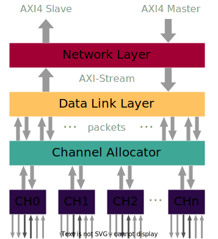

# Documentation of Serial Link
This folder contains the documentation of the architecture which is split into different modules:
* Network layer ([`serial_link_network`](../src/serial_link_network.sv))
* Data Link layer ([`serial_link_data_link`](../src/serial_link_data_link.sv))
* Channel Allocator ([`serial_link_channel_allocator`](../src/channel_allocator/serial_link_channel_allocator.sv))
* Physical layer ([`serial_link_physical`](../src/serial_link_physical.sv))

## Architecture
An high-level block diagram of the Serial Link design is shown below

## Configuration
The Serial Link has the following configuration Parameters:
| Name          | Type           | Definition                                                                                                                                                                                                              |
|---------------|----------------|-------------------------------------------------------------------------------------------------------------------------------------------------------------------------------------------------------------------------|
| `axi_req_t`   | `struct`       | arbitrary AXI request struct defined with `AXI_TYPEDEF` macro. Both Master and Slave ports need to use the same `req` struct                                                                                            |
| `axi_rsp_t`   | `struct`       | arbitrary AXI response struct defined with `AXI_TYPEDEF` macro. Both Master and Slave ports need to use the same `rsp` struct                                                                                           |
| `*_chan_t`    | `struct`       | AXI channel structs which matches `axi_req_t` and `axi_rsp_t`. Byproduct of `AXI_TYPEDEF` macro                                                                                                                         |
| `cfg_req_t`   | `struct`       | `register_interface` request struct defined with `REG_BUS_TYPEDEF` macro                                                                                                                                                |
| `cfg_rsp_t`   | `struct`       | `register_interface` response struct defined with `REG_BUS_TYPEDEF` macro                                                                                                                                               |
| `hw2reg_t`    | `struct`       | struct that defines signals from the logic to the configuration registers generated by `reggen` e.g. `serial_link_reg_pkg::serial_link_hw2reg_t`                                                                        |
| `reg2hw_t`    | `struct`       | struct that defines signals from the configuration registers defined by `reggen` to the logic e.g. `serial_link_reg_pkg::serial_link_reg2hw_t`                                                                          |
| `NumChannels` | `int unsigned` | Number of Channels of the Serial Link. If `NumChannels > 1`, a *Channel Allocator* will be instantiated                                                                                                                 |
| `NumLanes`    | `int unsigned` | Number of Lanes per Channel. Higher numbers reduce the wire overhead for the clocks for the source-synchronous interface but increase the timing complexity and defect probability. Recommended number of lanes are `8` |
| `NumCredits`  | `int unsigned` | Number of outstanding payloads in flight that have not been processed yet by the other side. Be careful with increasing this parameter as it will increase the FIFOs inside the Serial Link.                            |
| `MaxClkDiv`   | `int unsigned` | Maximum clock division factor. Mainly used to dimension the counter for the clock division generator                                                                                                                    |

## Ports
| Name            | Type                           | Description                                                                                                                                                                                                      |
|-----------------|--------------------------------|------------------------------------------------------------------------------------------------------------------------------------------------------------------------------------------------------------------|
| `clk_i`         | `logic`                        | Always-on system clock coming from the SoC domain. Only the configuration registers are connected to this clock                                                                                                  |
| `rst_ni`        | `logic`                        | Global asynchronous reset, active-low. Only the configuration registers are connected to this reset signal                                                                                                       |
| `clk_sl_i`      | `logic`                        | Clock for `serial_link_network`, `serial_link_data_link`, `serial_link_channel_allocator` and `serial_link_physical`. Intended for clock gating purposes, otherwise connect to `clk_i`                           |
| `rst_sl_ni`     | `logic`                        | Asynchronous reset, active low. Resets `serial_link_network`, `serial_link_data_link`, `serial_link_channel_allocator` and `serial_link_physical`. Intended for SW reset purposes, otherwise connect to `rst_ni` |
| `clk_reg_i`     | `logic`                        | Clock for `cfg_req_i` and `cfg_rsp_o`                                                                                                                                                                            |
| `rst_reg_ni`    | `logic`                        | Asynchronous active-low reset for `cfg_req_i` and `cfg_rsp_o`                                                                                                                                                    |
| `testmode_i`    | `logic`                        | Currently not used, tie to `'0`                                                                                                                                                                                  |
| `axi_in_req_i`  | `axi_req_t`                    | AXI4 Slave request port                                                                                                                                                                                          |
| `axi_in_rsp_o`  | `axi_rsp_t`                    | AXI4 Slave response port                                                                                                                                                                                         |
| `axi_out_req_o` | `axi_req_t`                    | AXI4 Master request port                                                                                                                                                                                         |
| `axi_out_rsp_i` | `axi_rsp_t`                    | AXI4 Master response port                                                                                                                                                                                        |
| `cfg_req_i`     | `cfg_req_t`                    | `register_interface` request port for configuration registers                                                                                                                                                    |
| `cfg_rsp_o`     | `cfg_rsp_t`                    | `register_interface` response port for configuration registers                                                                                                                                                   |
| `ddr_rcv_clk_i` | `logic[NumChannels]`           | Source-synchronous input clock to sample data. One clock per channel                                                                                                                                             |
| `ddr_rcv_clk_o` | `logic[NumChannels]`           | Source-synchronous output clock which is forwarded together with the data. One clock per channel                                                                                                                 |
| `ddr_i`         | `logic[NumChannels][NumLanes]` | Double-Data-Rate (DDR) input data                                                                                                                                                                                |
| `ddr_o`         | `logic[NumChannels][NumLanes]` | Double-Data-Rate (DDR) output data                                                                                                                                                                               |
| `isolated_i`    | `logic[1:0]`                   | AXI isolation observation signal for in and output. Currently not used, tie to `2'b0`. This signal can be observed through the configuration registers, intended to observe a `axi_isolate` module               |
| `isolate_o`     | `logic[1:0]`                   | AXI isolation control signal for in and output. Currently not used, can be left floating. This signal can be controlled over the configuration registers, intended to control a `axi_isolate` module             |
| `clk_ena_o`     | `logic`                        | Clock enable control signal. Currently not used, can be left floating. This signal can be controlled over the configuration registers, intented to control a clock gating cell                                   |
| `reset_no`      | `logic`                        | Asynchronous reset, active-low. SW controlable. Currently not used, can be left floating. Intended to SW reset wrapper modules like `axi_isolate` etc.                                                           |
