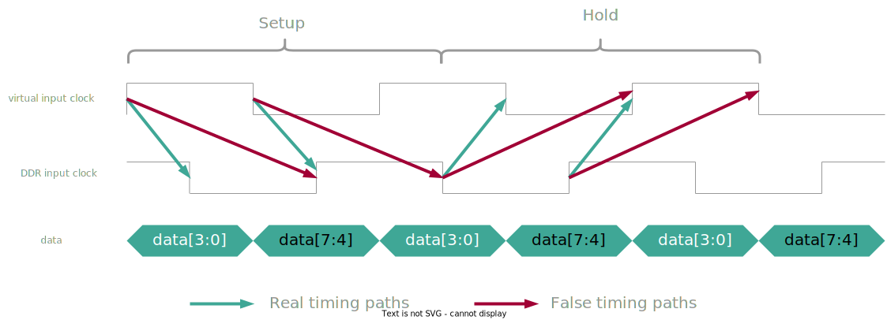

## Constraints
The Serial Link has Double-Data-Rate (DDR) and a source-synchronous interface with generated clocks which makes the constraints quite involved. The constraints were by the *Source-Synchronous DDR IO Timing Constraints Cookbook* by David Olsen, Altera Corporation, 2010.

### Generated and Virtual Clocks
The data is synchronous to a zero phase shifted clock. This clock needs to be defined as virtual since it does not exist at the receiver side. The actual clock is shifted with respect to the virtual clock by -90 or +270 degrees (resp. shifted by +90 degrees and then inverted). The clocks on RX side are generated the following way:

```sdc
# Rising edge is at 270 degree, falling edge at 450 (resp. 60) degrees
set edge_list [list [expr $T_FWD_CLK / 4 * 3] [expr $T_FWD_CLK / 4 * 5]]
create_clock -name vir_clk_ddr_in -period $T_FWD_CLK
create_clock -name clk_ddr_in -period $T_FWD_CLK -waveform $edge_list [get_ports ddr_rcv_clk_i]
```

The clocks on TX side are generated the following way:

```sdc
# The data launching clock with 0 degree clock phase
create_generated_clock -name clk_slow -source clk_i -divide_by $FWD_CLK_DIV \
    [get_pins -hierarchical clk_slow_reg/Q]

# this is the "forwarded clock", we are assuming it is shifted by -90 or +270 degrees (or +90 degrees and inverted)
set edge_list [list [expr 1 + $FWD_CLK_DIV / 2 * 3] [expr 1 + $FWD_CLK_DIV / 2 * 5] [expr 1 + $FWD_CLK_DIV / 2 * 7]]
create_generated_clock -name clk_ddr_out -source clk_i -edges $edge_list \[get_pins -hierarchical ddr_rcv_clk_o_reg/Q]
```

### False paths
DDR has some timing arcs that needs to be removed. See an illustration below



There is no conventional setup relationship (rise to rise and fall to fall).
We leave only the inter-clock launching edge to capturing edge timing arcs (rise to fall and fall to rise)

```sdc
# Input
set_false_path -setup -rise_from [get_clocks vir_clk_ddr_in] -rise_to [get_clocks clk_ddr_in]
set_false_path -setup -fall_from [get_clocks vir_clk_ddr_in] -fall_to [get_clocks clk_ddr_in]
# Output
set_false_path -setup -rise_from [get_clocks clk_slow] -rise_to [get_clocks clk_ddr_out]
set_false_path -setup -fall_from [get_clocks clk_slow] -fall_to [get_clocks clk_ddr_out]
```

There is no actual hold relationship from non consecutive launching to capturing edges; data change at every edge, therefore we can remove the timing arcs that do not go from the current edge to the previous one (rise to fall and fall to rise). We leave only inter-clocks hold relationship (fall to fall and rise to rise)
```sdc
# Input
set_false_path -hold  -rise_from [get_clocks vir_clk_ddr_in] -fall_to [get_clocks clk_ddr_in]
set_false_path -hold  -fall_from [get_clocks vir_clk_ddr_in] -rise_to [get_clocks clk_ddr_in]
# Output
set_false_path -hold  -rise_from [get_clocks clk_slow] -fall_to [get_clocks clk_ddr_out]
set_false_path -hold  -fall_from [get_clocks clk_slow] -rise_to [get_clocks clk_ddr_out]
```

There is on last false path from the system/fll clock to the forwarded clock
```sdc
set_false_path -from [get_pins my_system_clock_pin] -to [get_ports my_clk_ddr_out_port]
```

### I/O Delays
The input and ouput delay is constrained in a way that it arrives in between a window around the clock edge of the virtual (0 degree) clock for the input side resp. the forwarded clock (90 degree) for the output side.

```sdc
# Window has a margin on both side of 5% of a quarter of the clock period
set MARGIN              [expr $T_FWD_CLK / 4 * 0.05]

# Input delays
set_input_delay -max -clock [get_clocks vir_clk_ddr_in] [expr $MARGIN] [get_ports ddr_i]
set_input_delay -add_delay -min -clock [get_clocks vir_clk_ddr_in] [expr -$MARGIN] [get_ports ddr_i]
set_input_delay -add_delay -max -clock_fall -clock [get_clocks vir_clk_ddr_in] [expr $MARGIN] [get_ports ddr_i]
set_input_delay -add_delay -min -clock_fall -clock [get_clocks vir_clk_ddr_in] [expr -$MARGIN] [get_ports ddr_i]

# Output delays
set_output_delay -max -clock [get_clocks clk_ddr_out] [expr $T_FWD_CLK / 4 + $MARGIN] -reference_pin [get_ports ddr_rcv_clk_o] [get_ports ddr_o]
set_output_delay -add_delay -min -clock [get_clocks clk_ddr_out] [expr $T_FWD_CLK / 4 - $MARGIN] -reference_pin [get_ports ddr_rcv_clk_o] [get_ports ddr_o]
set_output_delay -add_delay -max -clock_fall -clock [get_clocks clk_ddr_out] [expr $T_FWD_CLK / 4 + $MARGIN] -reference_pin [get_ports ddr_rcv_clk_o] [get_ports ddr_o]
set_output_delay -add_delay -min -clock_fall -clock [get_clocks clk_ddr_out] [expr $T_FWD_CLK / 4 - $MARGIN] -reference_pin [get_ports ddr_rcv_clk_o] [get_ports ddr_o]
```

### Clock Domain Crossings
Every RX channel has a [`cdc_fifo_gray`](https://github.com/pulp-platform/common_cells/blob/master/src/cdc_fifo_gray.sv) module of the `common_cells` libary which needs to be constrained. Readers are refered to the documention of this module. Further, there is a [`cdc_2phase`](https://github.com/pulp-platform/common_cells/blob/master/src/cdc_2phase.sv) module to synchronize the `REG_BUS` which is connected to the configuration registers running with the system clock.
