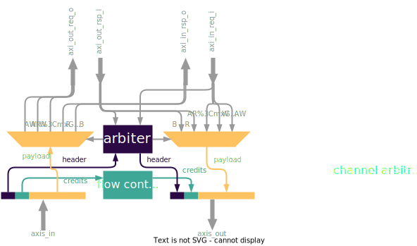

## Network layer
The Network layer has a duplex (Master/Slave) AXI4 interface and translates AXI4 transactions to AXI4-Streams and vice-versa. On the input side, it implements an arbiter to select an AXI4 beat (AW, W, B, AR, R) which is then forward to the Data Link Layer. The arbitration is implemented in a way that prevents deadlock caused by the AXI4 to AXI4-Stream protocol conversion. A block diagram is shown below

### Packeting
The payload that is sent to the data link layer contains the AXI beats (AW, W, B, AR, R), a header to encode type of AXI beat and credits for the flow control. Since B responses are very small, they are packeted together with one of the other AXI channels to prevent BW degredation.

### Arbitration
The arbitration of AXI requests and respones have the following priorities:
1. B responses are always granted as they can be sent along other req/rsp
2. AR/AW beats have priority, but only one AR/AW can be in flight each. Otherwise deadlocks can occur if the AR/AW beats have consumed all the credits but the transaction has not been terminated.
3. R/W beats have lowest priority

Further, W requests are not granted before the corresponding AW request. Arbitration between AR/AW and R/W beats are implemented as psuedo Round-Robin to prevent starvation of one channel.

### Flow control
Each time a new payload is granted, a credit counter is decremented. This allows to generate back-pressure to the AXI interface. Otherwise the FIFOs on the receiving side can potentially overflow. The credit counters are incremented once the receiving side sends back the credits together with a request/response. There is a mechanism to force the network layer to send out packets with an empty payload but with credits. This prevents deadlock situations where the communication is very onsided e.g. long write bursts. Technically, flow-control would be part of the Data Link layer. However, the implementation is simpler in the `serial_link_network` module since there are simple handshaking interfaces.